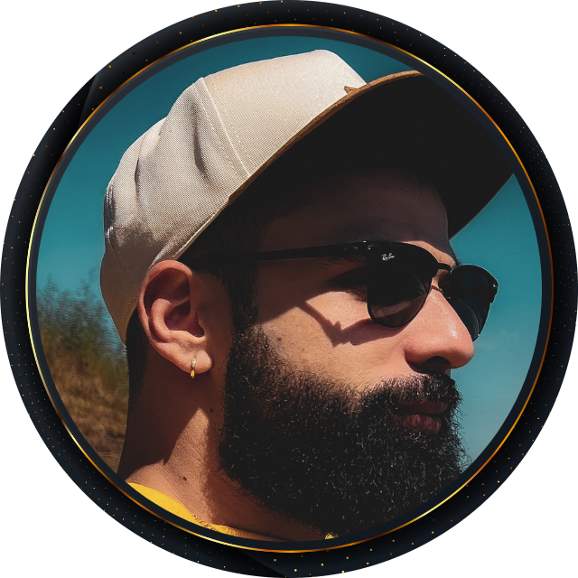
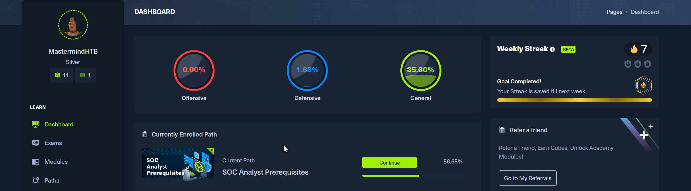
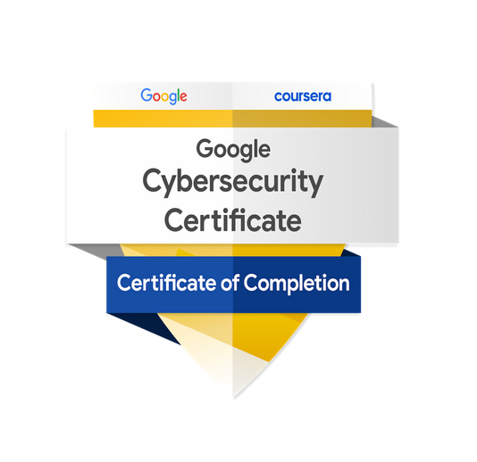

  

<em>“Not a pro. Just relentless.”</em>

  

# Hi, I’m Mastermind

Driven by curiosity, fueled by coffee. Blue team, coding, and always leveling up. 

#StayTuned

- **Cybersecurity:** Blue team focus, SOC analyst in training
- **Tech:** Linux, Python, Bash, automation
- 🏅 **Certs:** eJPT, Google Cybersecurity, and more
- **Always learning:** Logs, notes, and projects at [BlueSentinel](https://github.com/TheMastermindPT/BlueSentinel)

---

  
  &nbsp; &nbsp;
  

  
  
  

